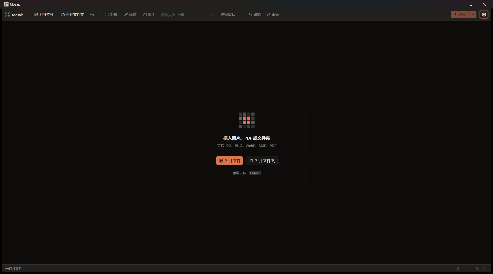
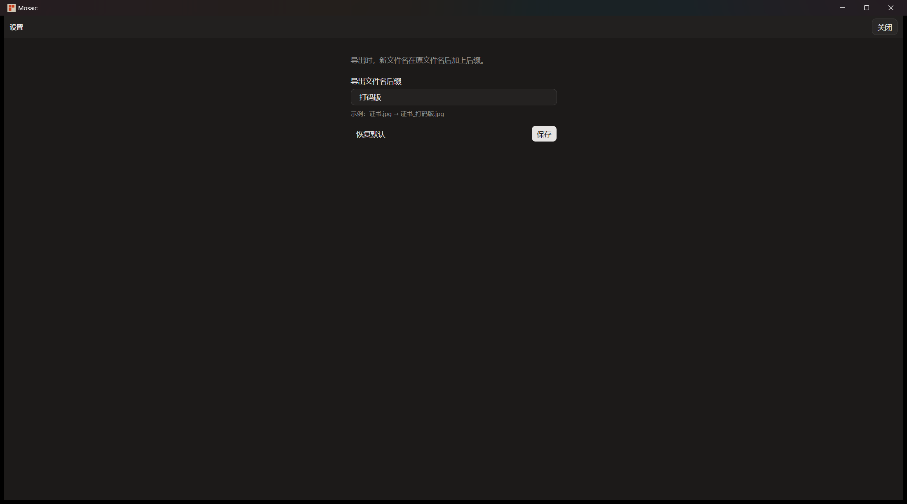
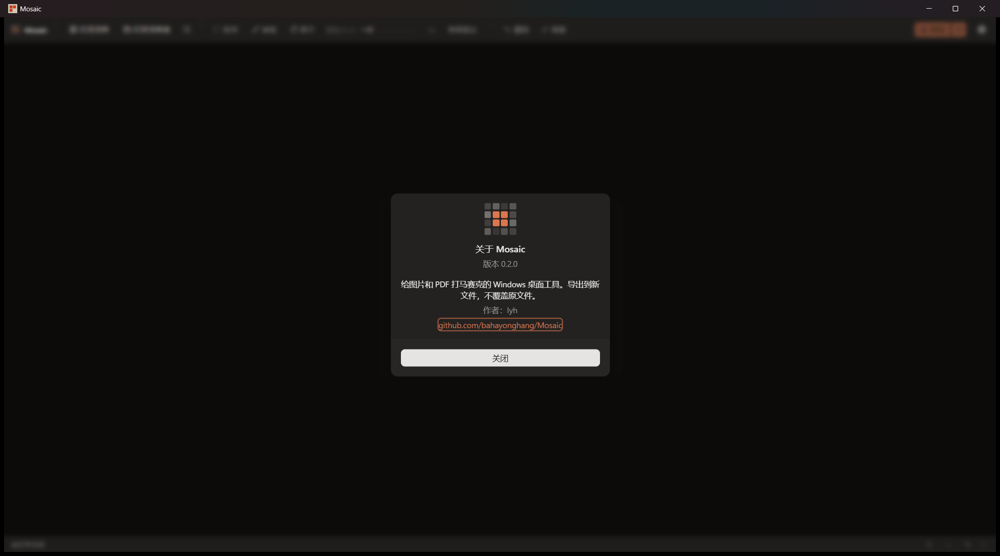

# 使用说明

Mosaic 在 Windows 上给图片和 PDF 打马赛克。导出到新文件，不覆盖原文件。

可以打开 JPG、JPEG、PNG、WebP、BMP 和 PDF。

## 主窗口

没打开文件时，状态栏写着「未打开文件」。中间是「拖入图片、PDF 或文件夹」，下面有「打开文件」和「打开文件夹」，也可以按 `Ctrl+O`。

工具栏里还有「矩形」「画笔」「抓手」「颗粒大小」「恢复默认」「撤销」「重做」和「导出」。没打开文件时，这些都不可用。

## 设置

点工具栏右侧的齿轮，再点「设置…」，进入设置页。标题是「设置」，右上角是「关闭」。

说明写着「导出时，新文件名在原文件名后加上后缀。」字段「导出文件名后缀」默认是 `_打码版`。页面上的示例是 `证书.jpg` 变成 `证书_打码版.jpg`。「恢复默认」把后缀填回 `_打码版`，「保存」之后才会按这个后缀导出。

## 关于

同一个齿轮菜单里的「关于 Mosaic」会打开弹窗，版本是 `0.2.0`。正文是「给图片和 PDF 打马赛克的 Windows 桌面工具。导出到新文件，不覆盖原文件。」作者是 lyh，下面是项目地址 github.com/bahayonghang/Mosaic。点「关闭」离开弹窗。
